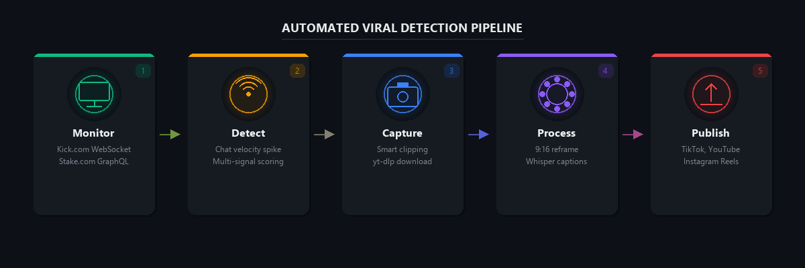
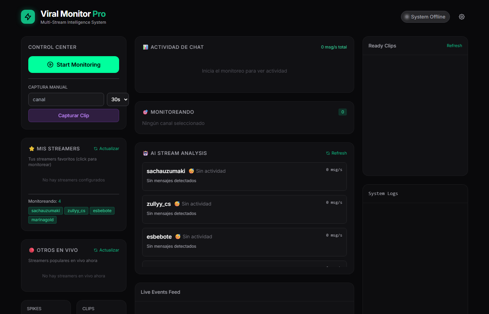
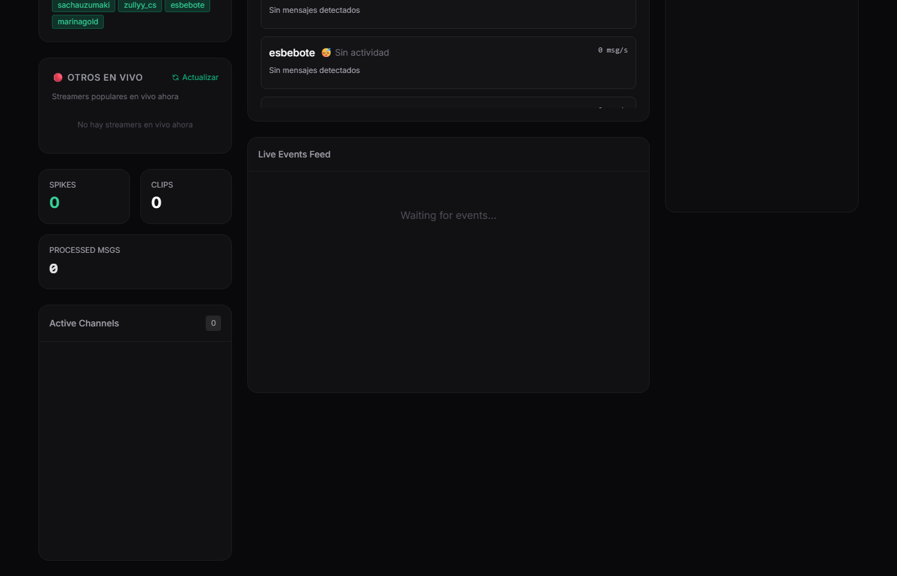
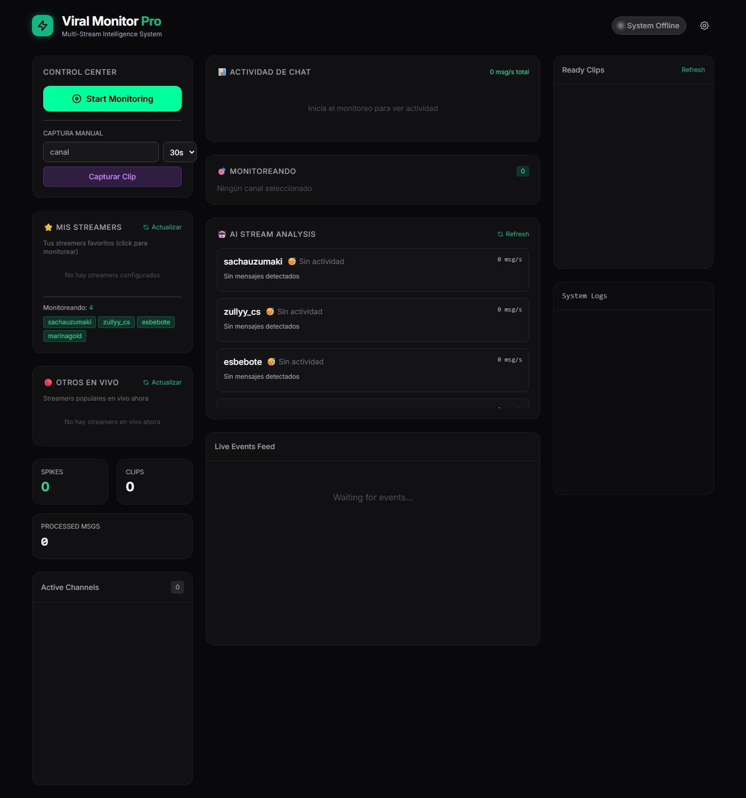

<p align="center">
  <h1 align="center">Stake Downloader</h1>
  <p align="center">
    <strong>Real-Time Viral Moment Detection & Capture</strong> &mdash; from Kick.com & Stake.com live streams.
  </p>
</p>

<p align="center">
  <a href="https://github.com/brolyroly007/Stake_downloader/actions/workflows/ci.yml"></a>
  <a href="https://github.com/brolyroly007/Stake_downloader/actions/workflows/docker.yml"></a>
  
  
  
  <a href="LICENSE"></a>
  <a href="https://github.com/psf/black"></a>
</p>

---

Automated system for detecting, capturing, and processing viral moments from live streams on **Kick.com** and **Stake.com** gambling platforms. Captures clips in real-time, processes them for social media (vertical reframe, auto-captions), and publishes to TikTok, YouTube Shorts, and Instagram Reels.

### How it works

<p align="center">
  
</p>

## Screenshots

<details>
<summary><strong>Web Dashboard</strong> — Real-time monitoring with WebSocket updates</summary>
<br>
<p align="center">
  
</p>
</details>

<details>
<summary><strong>Event Feed</strong> — Live spike detection across channels</summary>
<br>
<p align="center">
  
</p>
</details>

<details>
<summary><strong>Clip Library</strong> — Browse, play, and publish clips</summary>
<br>
<p align="center">
  
</p>
</details>

## Features

- **Real-Time Stream Monitoring** - WebSocket connection to Kick.com (Pusher protocol) and GraphQL polling for Stake.com
- **Virality Detection** - Multi-signal scoring system (chat velocity, audio peaks, big wins, emote spam)
- **AI Analysis** - Google Gemini integration for content analysis, title generation, and virality scoring
- **Automatic Clip Capture** - Downloads clips via yt-dlp with smart clipping (pre-spike + post-spike capture)
- **Video Processing** - Vertical reframe (9:16 / 1:1), automatic captions via OpenAI Whisper
- **Social Media Publishing** - Upload to TikTok, YouTube Shorts, and Instagram Reels
- **Web Dashboard** - Real-time FastAPI + WebSocket dashboard with live stats, clip library, and manual controls
- **Stream Buffer** - Circular buffer to capture moments *before* they're detected

## Architecture

```
                    +-----------------------+
                    |    WEB DASHBOARD      |
                    | FastAPI + WebSocket   |
                    +----------+------------+
                               |
                    +----------v------------+
                    |   MONITORS (Parallel)  |
                    |  - Kick (WebSocket)    |
                    |  - Stake (GraphQL)     |
                    +----------+------------+
                               |
                    +----------v------------+
                    |  VIRALITY DETECTION    |
                    |  - Multi-signal score  |
                    |  - Gemini AI analysis  |
                    +----------+------------+
                               |
                    +----------v------------+
                    |     PIPELINE           |
                    |  1. Download (yt-dlp)  |
                    |  2. Reframe (vertical) |
                    |  3. Captions (Whisper) |
                    +----------+------------+
                               |
                    +----------v------------+
                    |     PUBLISHERS         |
                    |  - TikTok              |
                    |  - YouTube Shorts      |
                    |  - Instagram Reels     |
                    +-----------------------+
```

## Project Structure

```
Stake_downloader/
├── app.py                  # FastAPI web application (main entry)
├── main.py                 # CLI entry point
├── launcher.py             # Simple server launcher
├── pipeline.py             # Download -> Process -> Publish pipeline
├── config.py               # Configuration loader
├── requirements.txt        # Python dependencies
│
├── core/                   # Core utilities
│   ├── config.py           # Pydantic settings with validation
│   └── logger.py           # Loguru structured logging
│
├── monitors/               # Real-time stream monitoring
│   ├── base_monitor.py     # Abstract base class + event system
│   ├── kick_monitor.py     # Kick.com WebSocket monitor
│   └── stake_monitor.py    # Stake.com GraphQL monitor
│
├── detectors/              # Virality detection
│   ├── virality_scorer.py  # Multi-signal weighted scoring
│   └── gemini_analyzer.py  # Google Gemini AI analysis
│
├── recorders/              # Video capture
│   ├── clip_downloader.py  # yt-dlp based downloader
│   ├── stream_buffer.py    # Circular buffer for pre-spike capture
│   ├── retroactive_clipper.py # Smart divide-and-conquer clipper
│   └── replay_renderer.py  # Playwright-based Stake replay capture
│
├── processors/             # Video processing
│   ├── reframe_vertical.py # 16:9 -> 9:16/1:1 reframing
│   ├── caption_generator.py # Whisper transcription + subtitles
│   └── video_compiler.py   # Final video assembly
│
├── publishers/             # Social media upload
│   ├── tiktok_uploader.py  # TikTok via Playwright
│   ├── youtube_shorts.py   # YouTube Shorts via Google API
│   └── instagram_reels.py  # Instagram Reels via instagrapi
│
├── web/                    # Frontend
│   └── index.html          # Dashboard UI (single-page app)
│
├── tests/                  # Test suite
├── docs/                   # Documentation
└── .env.example            # Environment variables template
```

## Virality Scoring System

The system uses weighted multi-signal analysis to detect viral moments:

| Signal | Weight | Description |
|--------|--------|-------------|
| Chat Velocity | 30% | Messages per second spike detection |
| Audio Peak | 25% | Streamer reactions (screams, excitement) |
| Big Win | 25% | Large casino wins above threshold |
| Emote Spam | 20% | Specific emote flooding in chat |

```
score = sum(signal_value * weight for each signal)

if score >= threshold:  # default 0.7
    trigger_capture()
```

## Installation

### Prerequisites

- Python 3.10+
- FFmpeg (for video processing)
- Chromium (for Playwright-based features)

### Setup

```bash
# Clone the repository
git clone https://github.com/brolyroly007/Stake_downloader.git
cd Stake_downloader

# Create virtual environment
python -m venv .venv

# Activate (Windows)
.venv\Scripts\activate

# Activate (Linux/Mac)
source .venv/bin/activate

# Install dependencies
pip install -r requirements.txt

# Install Playwright browser (for Stake replays)
playwright install chromium

# Configure environment
cp .env.example .env
# Edit .env with your values
```

### FFmpeg Installation

**Windows (winget):**
```bash
winget install Gyan.FFmpeg
```

**Linux:**
```bash
sudo apt install ffmpeg
```

**macOS:**
```bash
brew install ffmpeg
```

## Usage

### Web Dashboard (Recommended)

```bash
python app.py
# Open http://localhost:8000
```

The dashboard provides:
- Start/stop monitoring controls
- Channel management (add/remove)
- Real-time chat velocity graphs
- Live event feed with spike detection
- Clip library with player
- Manual capture and publish buttons
- AI analysis summaries per stream

### CLI Mode

```bash
# Default channels
python main.py

# Specify channels
python main.py --channels roshtein,trainwreckstv,xposed

# Adjust virality threshold
python main.py --threshold 0.6  # More sensitive
python main.py --threshold 0.8  # Less sensitive

# Debug mode
python main.py --debug

# Skip Stake monitoring
python main.py --no-stake
```

### Custom Port

```bash
python app.py --port 3000 --host 127.0.0.1
```

## Configuration

Copy `.env.example` to `.env` and configure:

| Variable | Default | Description |
|----------|---------|-------------|
| `KICK_CHANNELS` | `trainwreckstv,roshtein,xposed` | Channels to monitor |
| `CHAT_VELOCITY_THRESHOLD` | `50` | Messages/sec for spike |
| `VIRALITY_SCORE_THRESHOLD` | `0.7` | Minimum virality score |
| `GEMINI_API_KEY` | - | Google Gemini API key for AI analysis |
| `WHISPER_MODEL` | `base` | Whisper model (tiny/base/small/medium/large) |
| `BIG_WIN_THRESHOLD` | `10000` | USD threshold for big win detection |
| `USE_PROXIES` | `false` | Enable proxy rotation |

See `.env.example` for the full list of configuration options.

## API Endpoints

| Method | Endpoint | Description |
|--------|----------|-------------|
| `GET` | `/` | Web dashboard |
| `GET` | `/api/status` | System status |
| `POST` | `/api/start` | Start monitoring |
| `POST` | `/api/stop` | Stop monitoring |
| `POST` | `/api/channels` | Update monitored channels |
| `GET` | `/api/clips` | List captured clips |
| `GET` | `/api/clips/{id}` | Get specific clip |
| `POST` | `/api/capture/{channel}` | Manual clip capture |
| `POST` | `/api/publish/{id}/{platform}` | Publish clip to platform |
| `GET` | `/api/config` | Current configuration |
| `GET` | `/api/pipeline/status` | Pipeline processing status |
| `GET` | `/api/ai/summaries` | AI stream summaries |
| `POST` | `/api/ai/analyze` | Analyze text with Gemini |
| `WS` | `/ws` | WebSocket real-time updates |

## Tech Stack

- **Backend**: FastAPI, uvicorn, asyncio
- **Monitoring**: WebSockets (Pusher), GraphQL (httpx)
- **Video**: yt-dlp, FFmpeg, MoviePy, OpenCV
- **AI/ML**: OpenAI Whisper, Google Gemini
- **Browser Automation**: Playwright
- **Anti-Bot**: curl-cffi (Cloudflare bypass)
- **Frontend**: Vanilla JS, WebSocket API
- **Data Validation**: Pydantic
- **Logging**: Loguru

## Roadmap

- [x] Real-time Kick.com monitoring (WebSocket)
- [x] Real-time Stake.com monitoring (GraphQL)
- [x] Multi-signal virality detection
- [x] Web dashboard with WebSocket updates
- [x] Clip downloading (yt-dlp)
- [x] Smart retroactive clipping
- [x] Video reframing (vertical/square)
- [x] Auto-captions (Whisper)
- [x] Gemini AI content analysis
- [x] TikTok upload (Playwright)
- [x] YouTube Shorts upload (API)
- [x] Instagram Reels upload
- [ ] Database persistence (SQLite/PostgreSQL)
- [ ] Proxy rotation module
- [ ] Webhook integrations (Streamerbot, OBS)
- [ ] Scheduled auto-posting
- [ ] Multi-account management
- [ ] Cloud deployment (Docker)

## Disclaimer

This project is for **educational and personal use only**. Users are responsible for:

- Complying with each platform's Terms of Service
- Respecting content creators' intellectual property
- Using the tool responsibly and ethically
- Ensuring compliance with local laws and regulations

The authors are not responsible for any misuse of this software.

## License

This project is licensed under the MIT License - see the [LICENSE](LICENSE) file for details.

## Contributing

Contributions are welcome! Please read [CONTRIBUTING.md](CONTRIBUTING.md) for guidelines.
